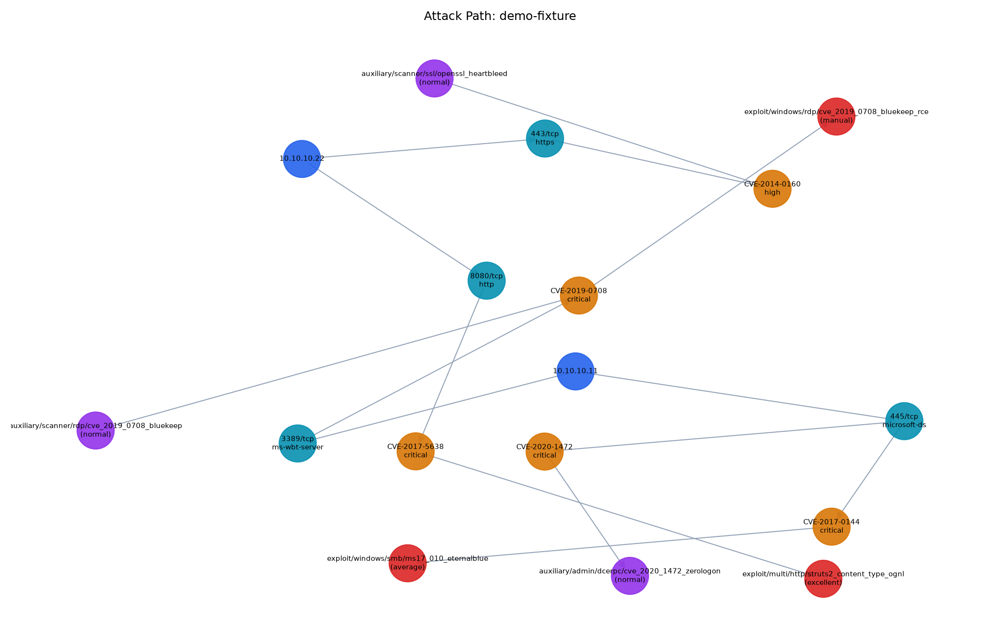

# Autonomous Pentest Orchestration & Verification Pipeline

A DevSecOps pipeline that automates the reconnaissance-to-verification loop of a pentest:
it discovers assets with **Nmap**, runs a vulnerability scan through the **Nessus REST API**,
then checks each CVE finding against the **Metasploit RPC API** to see whether a weaponized
module already exists for it — and outputs a consolidated JSON report plus a `networkx`
attack-path graph (`host → port → CVE → Metasploit module`).

```
Nmap  ──►  Nessus API  ──►  Metasploit RPC (msfrpcd)  ──►  report.json + attack_graph.png
```

Built to demonstrate API integration across a real security tool stack, not to be a general
autonomous-attack framework — see [Scope & ethics](#scope--ethics) below.

## Why this exists

Manually running Nmap, then Nessus, then cross-referencing CVEs against Metasploit's module
list by hand is slow and doesn't scale past a handful of hosts. This pipeline treats that
workflow as a small ETL job: structured input at each stage, typed data contracts between
stages, and a single artifact at the end that a triage engineer can actually read.

## Quickstart (demo mode — no Nessus/Metasploit install required)

```bash
git clone https://github.com/saif4224/autonomous-pentest-pipeline.git
cd autonomous-pentest-pipeline
pip install -r requirements.txt
python -m pentest_pipeline.cli --demo
```

This runs the full pipeline against bundled fixture data (a synthetic Nmap scan + Nessus
report) and writes `output/report.json` and `output/attack_graph.png`. No network access,
no real target, nothing installed beyond Python — it exists so anyone can see the pipeline
work end-to-end in under a minute.

Or via Docker:

```bash
docker compose up --build
```

## Live mode (real infrastructure)

Requires: `nmap` on PATH, a reachable Nessus instance, and (optionally) `msfrpcd` running —
without it, the exploit-mapping stage falls back to a small bundled offline CVE→module index.

```bash
cp config/config.example.yaml config/config.yaml   # fill in your Nessus API keys, msfrpcd password
msfrpcd -P <password> -a 127.0.0.1 -p 55553          # optional: enables live module lookups
python -m pentest_pipeline.cli --live --config config/config.yaml --targets 10.0.0.0/24
```

## Sample output

`report.json` (truncated):

```json
{
  "summary": {
    "hosts_discovered": 2,
    "open_ports": 4,
    "cve_findings": 5,
    "findings_with_weaponized_exploit": 3
  },
  "findings": [
    {
      "vulnerability": { "cve": "CVE-2017-0144", "severity": "critical", "host_ip": "10.10.10.11", "port": 445 },
      "matched_modules": [
        { "name": "exploit/windows/smb/ms17_010_eternalblue", "module_type": "exploit", "rank": "average" }
      ],
      "has_weaponized_exploit": true
    }
  ]
}
```

`attack_graph.png` — blue nodes are hosts, cyan are ports, amber are CVEs, red are verified
Metasploit exploit modules (purple = auxiliary/non-weaponized module):



## Architecture

See [`docs/architecture.md`](docs/architecture.md) for the stage-by-stage breakdown and a
diagram. Short version:

| Stage | What it does |
|---|---|
| **Discovery** | `nmap -sV -oX -` → parsed into typed `Host`/`Port` objects |
| **Vulnerability scan** | Drives the Nessus REST API scan lifecycle, parses the `.nessus` XML export |
| **Exploit mapping** | Queries `msfrpcd` (`search cve:<id>`) for matching modules; offline index fallback |
| **Reporting** | Consolidated JSON + `networkx` attack-path graph rendered to PNG |

## Testing

The whole pipeline is exercised in CI against fixture data (no live tools required):

```bash
pip install -r requirements-dev.txt
pytest --cov=pentest_pipeline
ruff check .
```

GitHub Actions runs lint + tests across Python 3.10-3.12, executes the demo pipeline
end-to-end, and builds/smoke-tests the Docker image on every push — see
[`.github/workflows/ci.yml`](.github/workflows/ci.yml).

## Scope & ethics

- The exploit-mapping stage only performs **reconnaissance**: it checks whether a Metasploit
  module *exists* for a CVE and reports its type/rank. It never selects a payload, configures
  a target, or fires an exploit.
- Live scanning (`--live`) must only be pointed at assets you own or are explicitly authorized
  to test.
- `config/config.yaml` (real credentials) is gitignored; only the `.example` template is
  committed.

## Tech stack

Python 3.10+ · `requests` (Nessus REST API) · `pymetasploit3` (Metasploit RPC) · `networkx` +
`matplotlib` (attack graph) · Docker · GitHub Actions

## License

[MIT](LICENSE)
