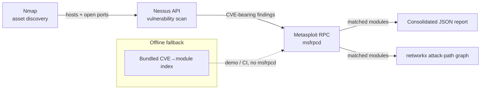

# Architecture

## Stages

| Stage | Module | Responsibility |
|---|---|---|
| 1. Discovery | `pentest_pipeline/discovery/nmap_scanner.py` | Shells out to `nmap -oX -`, parses XML into `Host`/`Port` objects |
| 2. Vulnerability scan | `pentest_pipeline/vulnscan/nessus_client.py` | Drives the Nessus REST API lifecycle (create → launch → poll → export), parses the `.nessus` XML export into `Vulnerability` objects |
| 3. Exploit mapping | `pentest_pipeline/exploit/msf_client.py` | Queries `msfrpcd` (`search cve:<id>` over the console RPC) for modules referencing each CVE; falls back to a bundled offline index when no RPC session is configured |
| 4. Reporting | `pentest_pipeline/report/json_report.py`, `attack_graph.py` | Consolidates everything into `report.json` and renders a `networkx` attack-path graph (`host → port → CVE → module`) to PNG |

`pentest_pipeline/pipeline.py` orchestrates stages 3-4 against already-collected discovery/vuln-scan output, which is what keeps the whole thing unit-testable without a live Nmap/Nessus/Metasploit deployment — see `tests/`.

## Scope note

The pipeline's exploit-mapping stage is reconnaissance only: it checks whether a Metasploit module *exists* for a given CVE and reports its type/rank. It does not select payloads, configure targets, or fire an exploit. Any live scanning must only be run against assets you own or are explicitly authorized to test.
